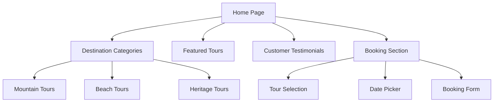
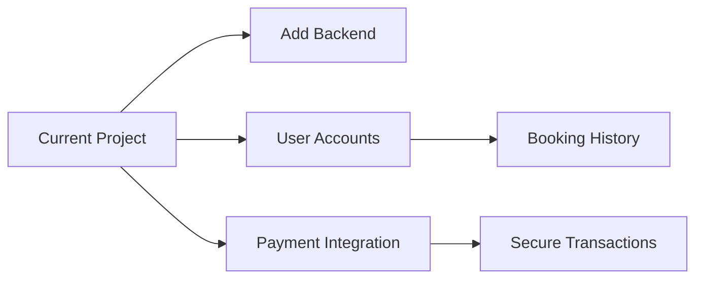

# Explore India - Travel Website 🌍

> A responsive travel website showcasing India's diverse destinations, built for DTU Hackathon

[](https://tour-and-travel-website-ten.vercel.app/)
[](https://github.com/ALOK-Yeager/Explore_India-travel-website-)

<div align="center">
  
  <p><em>homepage</em></p>
</div>

## Overview

Explore India is a responsive travel website built during the DTU Hackathon that showcases India's rich cultural heritage and diverse destinations. The project features a modern UI with smooth animations, destination categorization, and an intuitive booking interface.

**Note**: This project was completed approximately one year ago as a learning experience in frontend development.

## Features ✨

- **Destination Categories**: Explore destinations by type (Mountains, Beaches, Heritage, etc.)
- **Responsive Design**: Fully responsive across mobile, tablet, and desktop
- **Interactive UI**: Smooth animations and transitions
- **Featured Destinations**: Highlighted locations with detailed information
- **Booking System**: Intuitive tour booking interface
- **Testimonials**: Customer reviews and ratings

## Technology Stack 💻

| Frontend      | Libraries       |
|---------------|-----------------|
|  |  |
|  |  |
|  |  |

## Project Structure


 ## Screenshots 📸
Homepage	Category View	Booking
https://placehold.co/300x200?text=Home+Screen	https://placehold.co/300x200?text=Category+View	https://placehold.co/300x200?text=Booking+Form


	
## Installation and Setup 🛠️
Clone the repository:

```bash
git clone https://github.com/ALOK-Yeager/Explore_India-travel-website-.git
```
Open the project directory:

```bash
cd Explore_India-travel-website-
```

Launch in browser:

### For Windows:

```bash
start index.html
```

### For macOS:

```bash
open index.html
```
### For Linux:

```bash
xdg-open index.html
```
Live Demo
Experience the website: Explore India Live Demo

### Hackathon Experience 🏆
This project was developed during the DTU Hackathon where I:

Implemented responsive design principles

Created smooth UI animations and transitions

Developed under time constraints (12 hours)

Collaborated with team members remotely

Presented the final product to judges

### Future Improvements 🚀
- Backend Integration: Connect to a booking API

- User Authentication: Implement login/signup functionality

- Payment Gateway: Add secure payment processing

- Admin Dashboard: For tour management

- Interactive Map: Visual destination explorer

Diagram



### Contributions Welcome 🤝
Feel free to fork this project and submit pull requests! Please create an issue first to discuss major changes.

### License 📄
This project is licensed under the MIT License - see the LICENSE file for details.

Built with passion during DTU Hackathon
https://img.shields.io/badge/GitHub-Repository-blue?style=flat-square&logo=github
